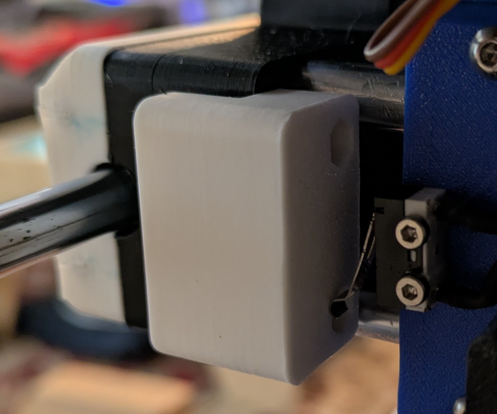
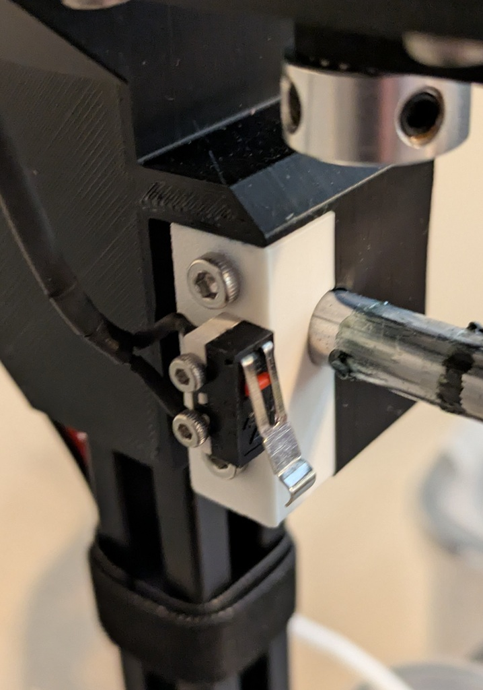

# X/Y Endstop Switches

Default for Magpie is to use sensorless homing.  Since my controller board had the older step drivers that does not support sensorless homing, I added limit switches for X/Y endstops.  Any micro switches that has mounting holes 6.5mm apart should work fine.
M2 bolts are used to directly thread into the plastic to mount the switches

The current x-carriage_rear has mounting holes for X-end stop.    Xy_endstop_bumper is used to add a bumper to the Y-carriage_right so the limit switches activates without crashing the X or Y carriage. 

Back_rod_holder was slightly modified to have mounting holes for the Y end stop switch.

Made by: https://github.com/rowokii