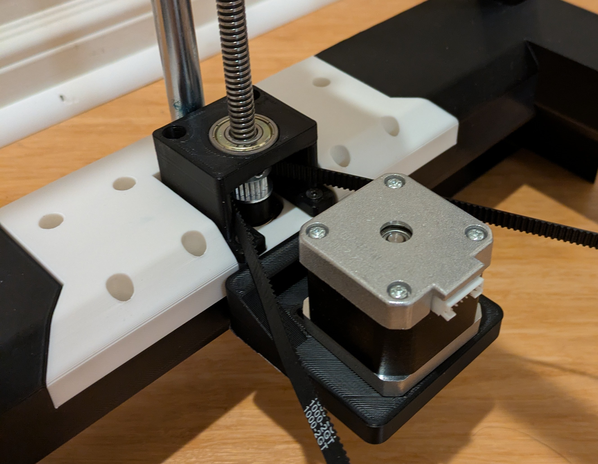
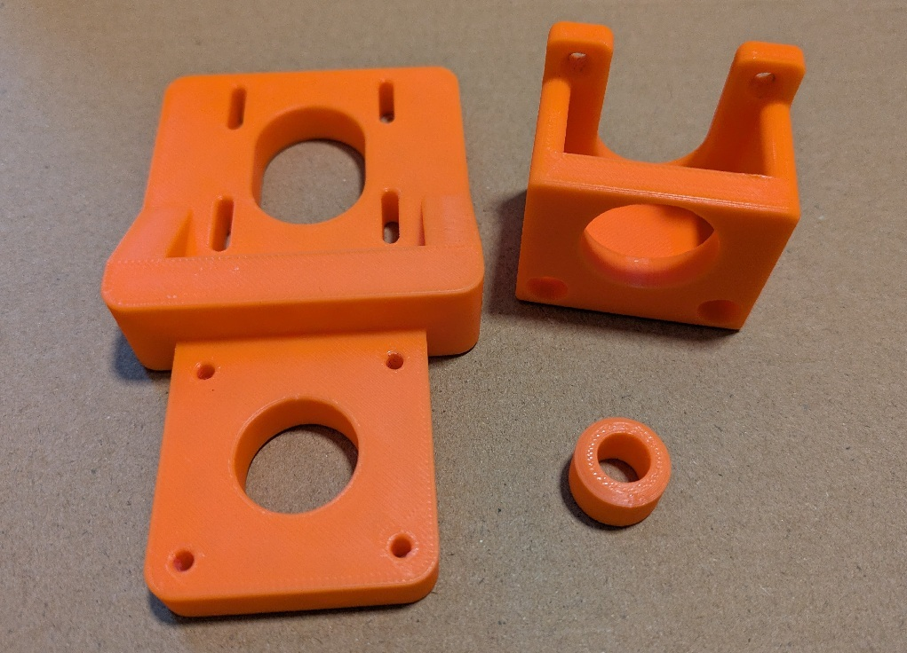
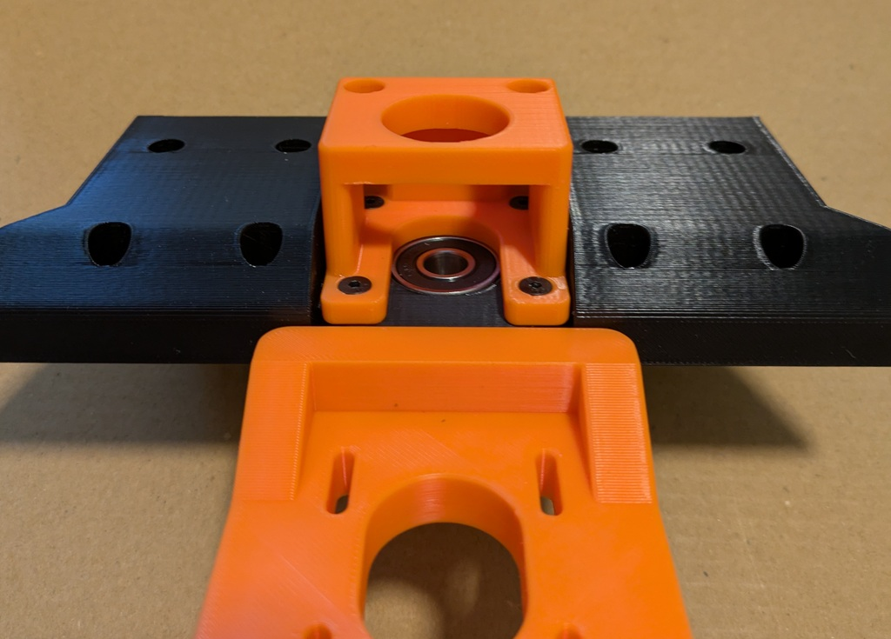
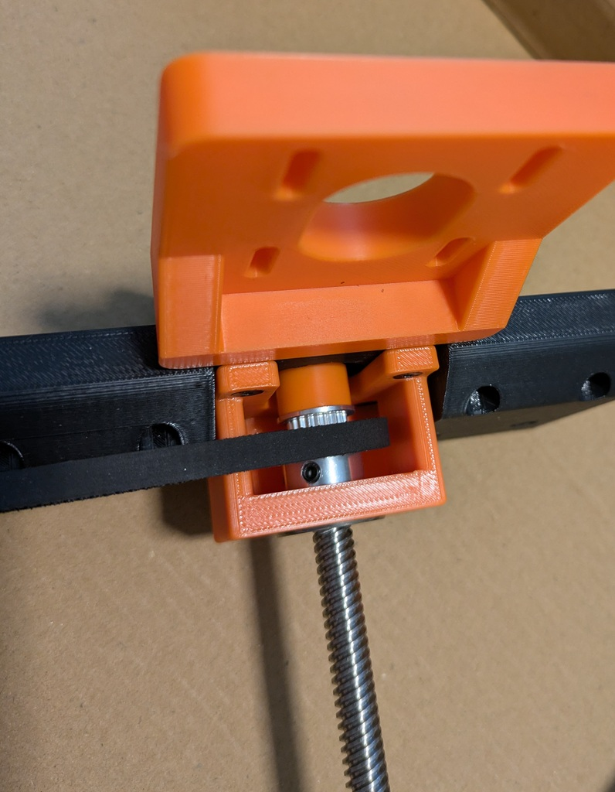
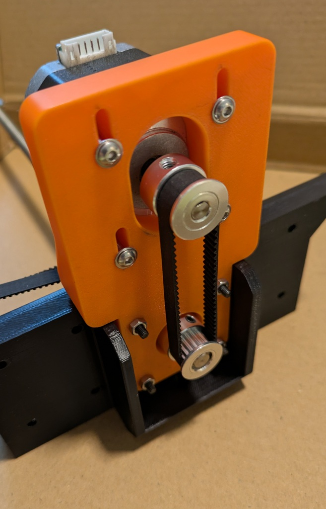

# Z Axis - Lead Screw Mod

Magpie BOM calls for NEMA 17 stepper motor with a 400mm lead screw integrated into it. 

This mod allows you to use a standard NEMA 17 stepper motor with a separate lead screw.  Since most couplers do not handle lateral force well, this mod supports the lead screw with two 608 bearing and the stepper motor drives the lead screw with a loop belt.  

 

This design was "optimized" to use parts I had in hand.

# BOM:

You need to 3d print the three step files.  They do not need supports if oriented as shown. 

 I used typical "Voron" print settings of .2mm layer height, .4mm line width, 4 walls, 5 top/bottom shell with 40% cubic infill .

You also need the below hardware: 

| #  |   Item   |  Description | 
| :---:  | :--- | :---|
| 4 | FHM3x30 | M3 flat head screw - 30mm long |
| 4 | M3x16   | M3 button head or socket head screw - 16mm long |
| 4 | M3 nuts | M3 nuts |
| 4 | M3 washer | M3 washer
| 2 | 608 Bearing | 608 Skate Bearing |
| 1 | GT2 20T 8mm | 20T GT2 Pulley with 8mm bore, 6mm width (You need 1 more than called by Magpie BOM) |
| 1 | GT2 20T 5mm | 20T GT2 Pulley with 5mm bore to be used with NEMA 17 stepper motor, 6mm width |
| 1 | GT2 - 160mm belt | GT2 loop belt 160mm long, 6mm wide |
| 1 | NEMA 17  | NEMA 17 Stepper motor for your Z axis | 
| 1 | 8mm Lead Screw | 8mm Lead Screw (1/3 lead screw from the BOM) |
| | | |

 
 

# Assembly

Press the 608 bearing in to the round hole in the "Rear_Bottom_Back.step" where the round part of the NEMA17 motor would normally press into.  Motor_mount is placed below and Coupling box is place above, trapping the 608 bearing.  Screw the parts together using FHM3x30 screw and m3 nuts.

 

Lead screw, the spacer block, GT2-20T-8mm and another 608 bearing is assembled as shown.  You need to have the 1M belt in the stack as well.  Do not tighten the grub screw on the GT-20T-8mm yet.

The NEMA 17 stepper motor is held in place with four M3x16 screws with washers.  GT2-20T-8mm pully is locked into place at the end of the lead screw.  Loop the GT2-160mm belt onto the GT2-20T-8mm and GT2-20T-5mm and press the GT2-20T-5mm onto the shaft of the NEMA 17 Stepper.  Tension and lock the motor in place and tighten all grub screws, including the one in the coupling box.

There is nothing holding down the 608 bearing at the top of the coupling box except fit friction and from the 1M belt loop tension, but after few hundred hours of print, I don't find this to be a problem.

Made by: https://github.com/rowokii