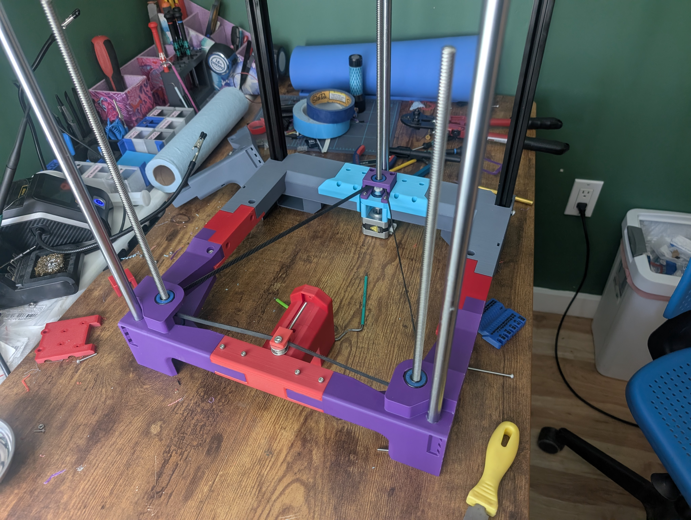
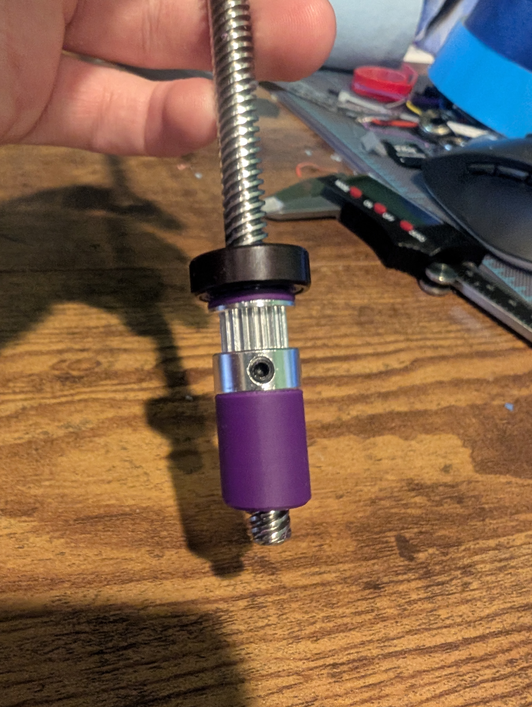
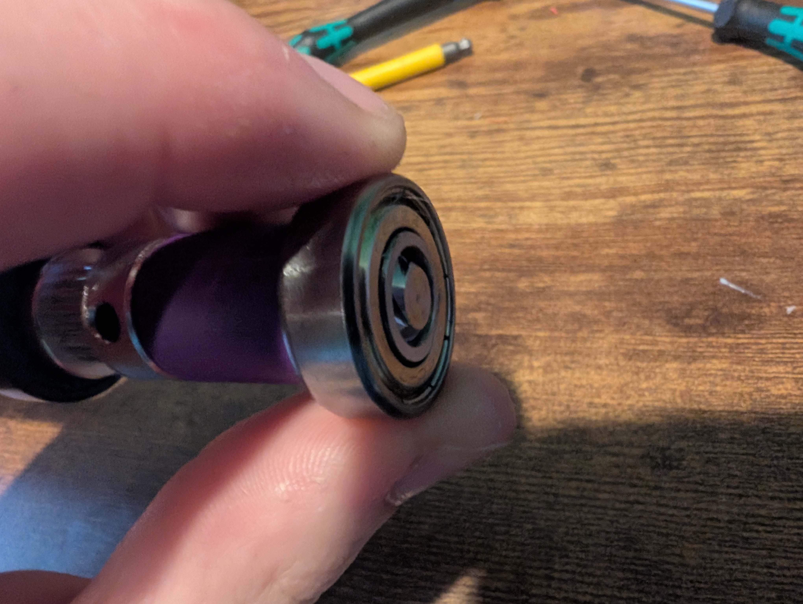
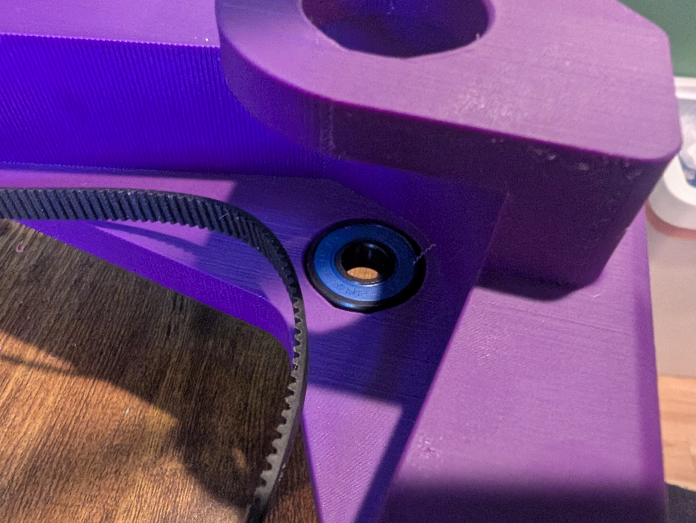
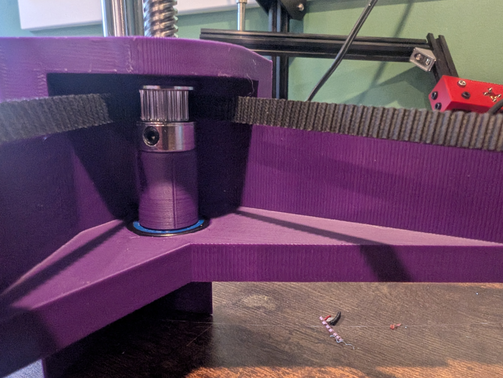
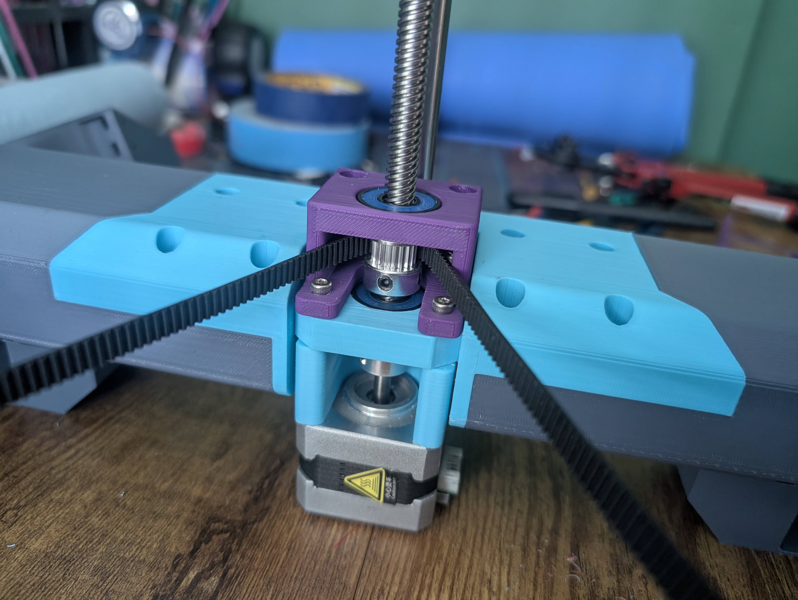

# Improved Magpie Z-Axis
This mod was made to fix the issues I had with the stock z-axis design and allow for re-use of more ender 3 parts -- the z motor and lead screws. This is achieved in the front by replacing the bottom KLF-08 bearings with 2 608 bearings. This makes all three lead screws secure enough that the pulling from the belt doesn't flex the lead screws removing the need to support the front lead screws on the top frame which means the lead screws can be shorter.
 
In the rear, a spacer and two additional 608 bearings are added: The spacer allows enough space to add a coupler to attach the lead screw to the motor shaft and the bearings -- like in the front -- secure the lead screws to not flex from the belt tension. 

Because the belt path does not change, there is a small loss of ~5-8mm of z travel. This could be fixed by lowering the belt path however, that would require changes to the tensioner parts as well. I wanted to keep this mod as minimal as possible to reduce needed reprinting so I chose to keep the same belt path. Lowering the belt path may also impact clearance on the back for larger pulleys.

## BOM
### Hardware
| Name | Qty | Note |
|:-----------:|:------------:|:------------:|
| 608 bearing   |   6   |    fushi brand recommended |
| M3x45mm bolts   |   4   |    for motor mount |
| 5x8mm coupler | 1 | reused from ender 3 |
| motor | 1 | reused from ender 3 |
### Printed Parts 
| Name | Qty |
|:-----------:|:------------:|
|  zcorner_R  |   1   |
|  zcorner_L  |   1   |
| motor_spacer_25mm   |   1   |
| Z-axis_mod-Coupling_box   |   1   |
| spacer_bottom | 2 |
| spacer_top | 2 |

## Assembly
Place the parts on the leadscrew in this order:
1. 608 bearing
2. top_spacer with the larger chamfer side toward the bearing (up)
3. pulley in upright position
4. bottom spacer with the larger chamfer side toward the bearing (down)

place the bottom bearing on the lead screw and align the stack so the lead screw is slightly proud of the bottom bearing when fully seated

remove the bottom bearing from the stack and insert it into the zcorner part

place the stack on the zcorner part and make sure the belt is around the stack

push the top bearing into place on the zcorner part

move the belt onto the pulley and tighten the set-screws

unfortunately i didn't take photos of the rear assembly so this will be primarily text:

1. place the coupler on the motor shaft
2. place the spacer on the motor
3. place the motor and spacer under the motor mount
4. insert the lead screw into the motor coupler and tighten the coupler to both the lead screw and motor shaft
5. optionally use M3x40mm screws to attach the motor through the spacer to make the next step easier
6. press a 608 bearing into the motor mount while keeping the motor and spacer against the bottom of the mount
	- if the 608 bearing sticks out more than 1-3mm, remove it and continue to the next step
	- if the bearing sticks out less than 1-3mm, loosen the coupler and move onto the next step
	- if you did step 5, remove those screws before the next step
7. remove the lead screw from the motor coupler
8. place the coupling box on the motor mount and screw the motor in using the M3x45mm bolts
9. press a 608 bearing into the coupling box
10. place the pulley on the belt and push it into the position in the image
11. insert the lead screw through the top bearing, pulley and bottom bearing (if there is one) into the coupler
12. push the coupler onto the lead screw until it either is fully seated or has a 1mm gap between the coupler and bottom bearing then tighten the coupler
13. align the pulley to the belt path and/or front pulleys then tighten the set-screws
14. Congratulations, you have finished assembling this mod!

